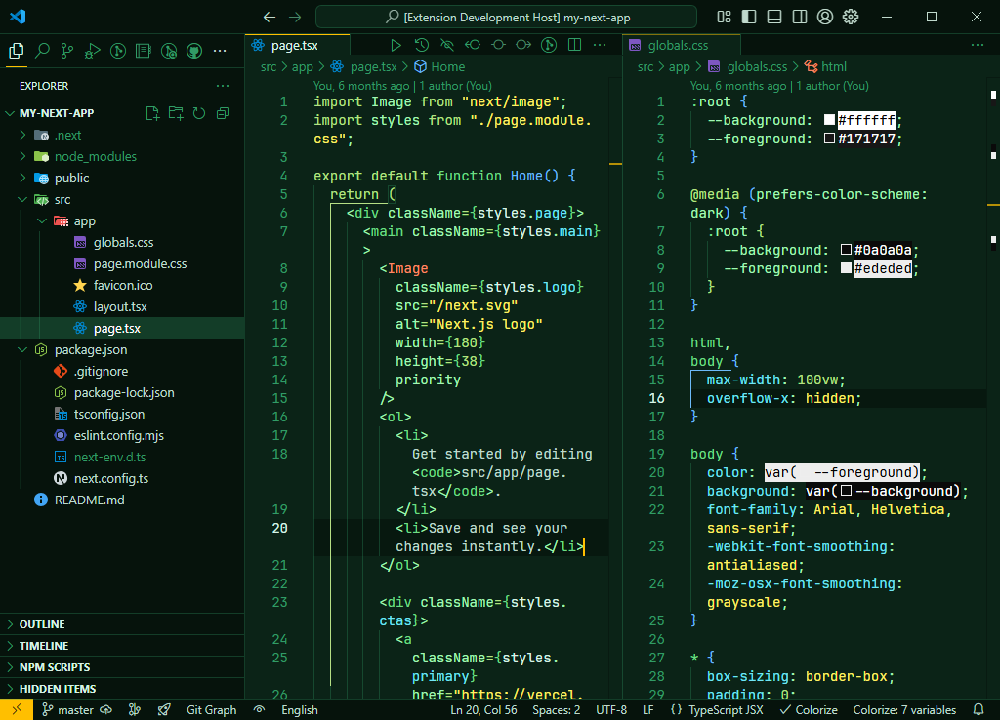
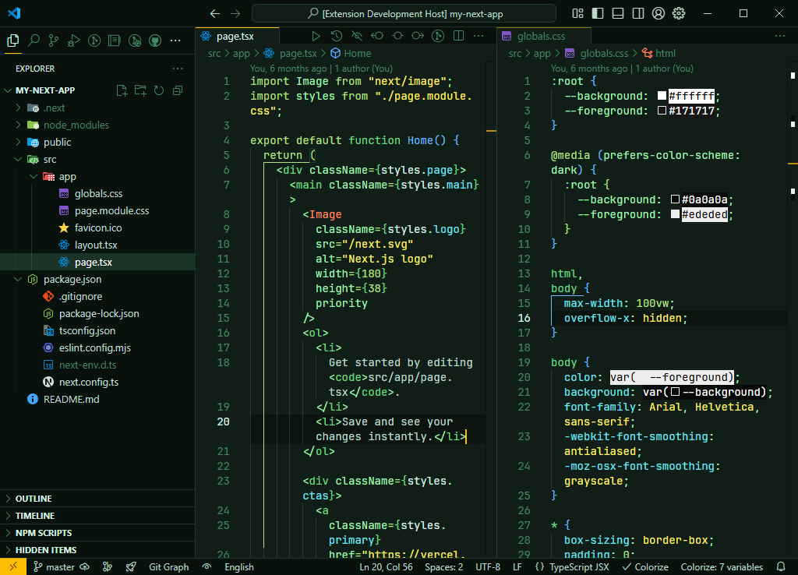

  
  <h1>for Visual Studio Code</h1>

  <h2>Mojito Pro</h2>
  

  <h2>Mojito Pro Dark</h2>
  

## Getting started

You can install this awesome theme through the [Visual Studio Code Marketplace](https://marketplace.visualstudio.com/items?itemName=mishatoshi.mojito-pro-vscode-theme&ssr=false#overview).

### Easy Installation

1. Open the extensions sidebar on Visual Studio Code
2. Search for **Mojito Pro**
3. Click **Install** to install it
4. Code/File ＞ Preferences ＞ Color Theme ＞ **Mojito Pro** or **Mojito Pro Dark**
5. 🌟 Did you like the theme? Please rate it with [five stars](https://marketplace.visualstudio.com/items?itemName=mishatoshi.mojito-pro-vscode-theme&ssr=false#review-details)

### Alternate Installation

1. Launch Quick Open using <kbd>Cmd</kbd>+<kbd>P</kbd> — or — <kbd>Ctrl</kbd>+<kbd>P</kbd>
2. Paste the command `ext install mishatoshi.mojito-pro-vscode-theme`
3. Click **Install** to install it
4. Code/File ＞ Preferences ＞ Color Theme ＞ **Mojito Pro** or **Mojito Pro Dark**
5. 🌟 Did you like the theme? Please rate it with [five stars](https://marketplace.visualstudio.com/items?itemName=mishatoshi.mojito-pro-vscode-theme&ssr=false#review-details)

## Override this theme

To override this (or any other) theme in your personal config file, please follow the guide in the [color theme](https://code.visualstudio.com/api/extension-guides/color-theme) documentation. This is handy for small tweaks to the theme without having to fork and maintain your own theme.

## Other versions

* Windows Terminal, PowerShell, CMD [https://github.com/mishatoshi/mojito-pro-windows-terminal](https://github.com/mishatoshi/mojito-pro-windows-terminal)
* Oh My Posh [https://github.com/mishatoshi/mojito-pro-oh-my-posh-theme](https://github.com/mishatoshi/mojito-pro-oh-my-posh-theme)
* Flow Launcher [https://github.com/mishatoshi/mojito-pro-flowlauncher-theme](https://github.com/mishatoshi/mojito-pro-flowlauncher-theme)

## License

[MIT License](./LICENSE)
